**1. 趋势的定义与特征**

*   **什么是趋势？** 趋势是指价格主要朝一个方向运动。
*   **趋势通道：** 所有趋势都运行在通道内，即使有些通道非常陡峭或对初学者不太明显。通道下方是趋势线，上方是趋势通道线。趋势通道线可以是趋势线的平行线，也可以连接各个高点形成。
*   **K线数量：** 趋势可以小到单根K线，也可以大到覆盖整个图表。
*   **主要趋势与次要趋势：** 在图表上，同一时间最多只会存在一到两个主要趋势。如果看到三四个所谓的趋势，它们通常是次要趋势，被称为“波动”或“波段”。主要更高低点通常伴随非常强劲的牛市突破，能创出新高。

**2. 牛市趋势 (Bull Trend)**
*   **特征：** 牛市趋势需要不断抬高的低点 (Higher Lows) 和更高的高点 (Higher Highs)。其中，抬高的低点比更高的高点更重要，因为它决定了交易者设置止损的位置。
*   **止损设置：** 波段交易者通常将保护性止损设在牛市腿（主要低点）的底部下方。不应将止损设在次要的较高低点下方，因为那样容易被止损出局，而市场随后可能继续上涨。正确的止损位应设在上一波强势上涨行情的底部下方。
*   **追踪止损：** 当牛市腿创出新高，并有大阳线收盘于高点时，可以将止损位提高到该波段的底部下方。特别是如果新高伴随失败的熊市突破，多头不应允许市场跌破该点位。
*   **通道衰竭：** 如果市场跌破前期较高低点，通道可能变得更宽、更平缓，形成一个更宽更平的牛市通道。趋势可能减弱或转变为交易区间，甚至可能转为熊市趋势，但强劲上涨的趋势通常会先转变为交易区间。
*   **反转尝试：** 在牛市通道中，多头预期所有反转尝试都会失败，因此看到空头反转信号时反而会加仓买入。他们认为趋势将持续，并在阴线收盘时买入，止损设在最近的重要低点下方。

**3. 熊市趋势 (Bear Trend)**
*   **特征：** 熊市趋势需要不断降低的高点 (Lower Highs) 和更低的低点 (Lower Lows)。它被包含在一个下降通道中。通道上轨是下跌趋势线，下轨是通道线。
*   **止损设置：** 空头通常将止损设在某个重要抛售高点（主要高点）上方。不应将止损设在次要的较低高点上方，因为那不是一个特别强势的向下突破或新低点，市场很容易突破它并仍然处于下跌趋势中。
*   **追踪止损：** 当熊市腿创出新低，并有大阴线收盘于低点时，可以将止损位降低到该波段的顶部上方。特别是如果新低伴随失败的牛市突破，空头认为市场不应突破该K线高点。
*   **通道衰竭：** 如果市场反弹突破前期较低高点，可能转变为更平缓的弱势下跌趋势或震荡区间。紧凑的熊市通道通常难以直接转为牛市趋势，多头最多只能争取到一个交易区间。
*   **反转尝试：** 空头会在每次强劲反弹时卖出，预期反转尝试会失败并形成熊旗。他们会在通道顶部或附近寻找反转做空机会。

**4. 交易策略与心态**
*   **不明朗时按震荡区间处理：** 当市场方向不明确，且多空双方都有合理依据时，应假设市场处于震荡区间 (Trading Range, TR)。每个震荡区间都包含多头和空头趋势的起点。
*   **趋势中包含震荡区间：** 所有趋势都包含震荡区间，每次回调和停顿都是小型震荡区间。当震荡持续约20根K线时，趋势反转的概率与趋势延续相当。
*   **顺势交易：** 在市场明确处于趋势中时，顺着趋势方向交易更容易获利。当下降通道紧凑时，最好持有空头头寸，直到趋势出现明确结束信号。
*   **止损的重要性：** 无论处于趋势还是震荡行情，每笔交易都必须设置保护性止损，且必须实际挂入市场。止损不能仅停留在脑海中，否则容易为持有错误头寸找理由。
*   **新手常见错误：**
    *   过度关注风险，寻找最小止损位，等待回调入场，从而错过大部分趋势和利润。
    *   在强势趋势中，新手常逆势操作，不断亏损。他们只看到紧止损和小风险，却忽视了概率。
    *   在牛市中不断尝试做空，或在熊市中不断尝试做多，因为止损看起来很近，但成功概率极低。任何低风险的交易必然伴随低概率。
    *   多数反转尝试会失败：在强势牛市中，80%的反转尝试（例如楔形顶部）都会失败，最终演变为牛旗形态。

**5. 趋势的类型**
趋势可根据其行为特征进行分类，不同类型的趋势提供不同的交易机会，需要采取不同的交易策略。
*   **突破 (Breakout) 或 冲刺 (Spike)：**
    *   突破是趋势中最强劲的形态。它可能由单根K线或连续的K线组成。
    *   强势突破的K线实体大，收盘接近极端（阳线收盘接近高点，阴线收盘接近低点）。
    *   强劲突破常伴随跳空缺口，表示市场有强烈紧迫感。
    *   即使是小的突破，也可能引发大的趋势。
    *   对新手而言，大K线突破可能令人望而生畏，但这是最高概率获得大额利润的信号，必须买入，即使仓位很小。
*   **通道 (Channel)：**
    *   通道是较弱的趋势类型，存在双向交易。通道线很少完美契合，需要不断重绘。
    *   **75%法则：**
        *   每个熊市通道（无论是否熊市趋势中的回调）有75%的概率出现向上突破。因此，每个熊市通道都可以被视为牛市旗形。
        *   每个牛市通道（无论是否牛市趋势中的回调）有75%的概率出现向下突破。因此，每个牛市通道都可以被视为熊市旗形。
    *   通道通常会演变为震荡区间，并测试通道的起点附近位置。
*   **开盘即发趋势 (Trend from the Open)：**
    *   指市场在开盘时或开盘后不久形成数小时甚至全天的最高点或最低点。
    *   常伴随跳空缺口和连续大实体K线收盘于极端，显示出强烈的紧迫感。
    *   在外汇等24小时市场，由于开盘时间不固定且时段重叠，通常直接称之为“突破行情”而非“开盘趋势”。
*   **趋势性震荡区间 (Trending Trading Ranges)：**
    *   市场形成10-30根K线的震荡区间，其幅度通常约为日均波幅的一半。
    *   预期该区间通常会翻倍。
    *   短暂突破（1-5根K线）后，市场进入新的震荡区间。
    *   通常有60%的概率会从区间下部回升至前一个区间的底部上方。
    *   趋势性震荡区间中常出现其他形态，如楔形底、三角形。
*   **宽幅通道趋势 (Broad Channel Trend)：**
    *   趋势中伴随深度回调。
    *   常呈现“阶梯式”模式 (Stairs pattern)，即每次回调都升破突破点底部后继续下跌。这表明趋势疲软，市场可能进入震荡区间。
    *   许多K线处于震荡区间内，市场方向常不明确。
    *   交易策略倾向于“低买高卖，快速剥头皮” (Buy Low, Sell High, Scalp, BLSHS)。
    *   在宽阔的牛市通道中，尽管有强劲的熊市回调，但只要持续形成更高低点和更高高点，仍视为牛市趋势。
*   **紧密通道 (Tight Channel)：**
    *   是强势趋势的一种，在更高时间周期图表上表现为突破形态。
    *   回调幅度很小，持续时间短。
    *   交易时应像对待突破行情一样，只在趋势方向进行交易（牛市只买入，熊市只卖出）。
    *   紧密通道中的缺口是强势趋势的信号。
*   **小幅回调趋势 (Small Pullback Trend)：**
    *   是最强劲的趋势类型。
    *   回调幅度很小，通常只持续1-4根K线，且回调幅度小于平均K线两倍。
    *   常伴随跳空缺口，即使K线形态疲软，缺口的存在也预示着市场比表面更强势，是强劲趋势的信号。
    *   这种趋势经常看起来像是交易区间中的波段，但缺口的存在使其更可能是小幅回调趋势。
    *   在小幅回调趋势中，多头会在移动平均线附近寻找买入机会，尤其是在20根K线或更多K线之后首次触及移动平均线时。

**6. 其他交易概念**

*   **测算目标 (Measured Move, MM)：** 大幅突破通常至少有60%的概率走出一段等距涨幅。
*   **收敛阶梯 (Shrinking Stairs)：** 指阶梯形态中每次突破幅度都在缩小，表明多头信心减弱或空头信心增强，通常是向震荡区间过渡的开始。
*   **楔形 (Wedge)：** 强劲趋势常形成楔形，但当通道很窄时，这些楔形反转往往会失败，成为旗形。
*   **动量缺失 (Lack of Momentum)：** 强劲的牛市突破后如果缺乏后续动能，可能导致市场进入交易区间。
*   **移动平均线支撑/阻力 (Support at Moving Average)：** 价格在强劲趋势中可能长时间保持在移动平均线之上，当回调触及移动平均线时，常引发反转。若出现“缺口K线”（K线高点与移动平均线之间有缺口），通常是市场尝试重大趋势反转前的最后一次反弹。 根据内容，请整理成mermaid流程图

交易主要流程图

```mermaid
graph TD
    %% --- 1. 起点与核心判断 ---
    A[开始: 观察图表] --> B{趋势是否明确?};
    B -- "是" --> C{是牛市还是熊市?};
    B -- "否 (方向不明朗)" --> D["按震荡区间(Trading Range)处理"];

    %% --- 2. 震荡区间 (Trading Range) 路径 ---
    subgraph 震荡区间策略
        D --> D1["<b>定义:</b> 多空力量均衡<br>包含未来牛市和熊市的起点"];
        D1 --> D2["<b>核心策略:</b> 低买高卖, 快速剥头皮 (BLSHS)"];
        D2 --> D3["<b>注意:</b> 当震荡持续约20根K线, 趋势反转与延续概率相当"];
    end
    D2 --> Z_StopLoss; 

    %% --- 3. 趋势路径 (牛市与熊市) ---
    C -- "牛市" --> Bull_Start["<b>特征:</b> 更高的高点(HH)和更高的低点(HL)<br>HL比HH更重要"];
    C -- "熊市" --> Bear_Start["<b>特征:</b> 更低的高点(LH)和更低的低点(LL)"];

    %% --- 3.1 牛市分支 ---
    subgraph 牛市趋势
        Bull_Start --> Bull_Strategy["<b>核心策略:</b> 顺势交易, 寻找买入机会"];
        Bull_Strategy --> Bull_Stop["<b>止损设置:</b> 设在上一波强势上涨行情的<br><b>主要低点</b>下方"];
        Bull_Strategy --> Bull_Mindset["<b>心态:</b> 预期空头反转会失败 (变为牛旗)<br>可在阴线或反转信号时加仓买入"];
        Bull_Stop --> Bull_Trail{"新高出现且有大阳线强势收盘?"};
        Bull_Trail -- "是" --> Bull_Trail_Yes["<b>追踪止损:</b> 将止损位提高到<br>该新波段的底部下方"];
        Bull_Trail -- "否" --> Bull_Trail_No["维持原有止损"];
        Bull_Start --> Bull_Type{识别具体趋势类型};
    end

    %% --- 3.2 熊市分支 ---
    subgraph 熊市趋势
        Bear_Start --> Bear_Strategy["<b>核心策略:</b> 顺势交易, 寻找卖出(做空)机会"];
        Bear_Strategy --> Bear_Stop["<b>止损设置:</b> 设在某个<b>主要高点</b>上方"];
        Bear_Strategy --> Bear_Mindset["<b>心态:</b> 预期多头反弹会失败 (变为熊旗)<br>可在强劲反弹至通道上轨时做空"];
        Bear_Stop --> Bear_Trail{"新低出现且有大阴线强势收盘?"};
        Bear_Trail -- "是" --> Bear_Trail_Yes["<b>追踪止损:</b> 将止损位降低到<br>该新波段的顶部上方"];
        Bear_Trail -- "否" --> Bear_Trail_No["维持原有止损"];
        Bear_Start --> Bear_Type{识别具体趋势类型};
    end

    %% --- 4. 趋势类型的细分 (强弱区分) ---
    %% 牛市趋势类型
    Bull_Type --> Bull_Strong_Types{"是强劲趋势还是弱势趋势?"};
    Bull_Strong_Types -- "强劲趋势" --> Bull_Type_Breakout["<b>突破/冲刺:</b> 强势大K线, 或伴随跳空缺口<br><b>策略:</b> 必须跟进买入, 最高概率机会"];
    Bull_Strong_Types -- "强劲趋势" --> Bull_Type_Tight["<b>紧密通道:</b> 回调极小, K线重叠少<br><b>策略:</b> 只做多, 视同突破行情"];
    Bull_Strong_Types -- "强劲趋势" --> Bull_Type_SmallPB["<b>小幅回调趋势:</b> 回调仅1-4根K线, 伴随缺口<br><b>策略:</b> 在移动平均线附近寻找买点"];
    
    Bull_Strong_Types -- "弱势/回调趋势" --> Bull_Type_Broad["<b>宽幅通道:</b> 深度回调, 阶梯模式<br><b>策略:</b> 类似震荡, 低买高卖, 快速剥头皮"];
    Bull_Strong_Types -- "弱势/回调趋势" --> Bull_Type_TrendingTR["<b>趋势性震荡区间:</b> 短暂突破后进入新区间<br><b>策略:</b> 预期区间翻倍, 在区间下部买入"];
    Bull_Strong_Types -- "弱势/回调趋势" --> Bull_Type_Channel["<b>普通通道:</b> 双向交易机会<br><b>注意:</b> 75%概率最终向下突破(演变为熊旗)"];

    %% 熊市趋势类型 (镜像)
    Bear_Type --> Bear_Strong_Types{"是强劲趋势还是弱势趋势?"};
    Bear_Strong_Types -- "强劲趋势" --> Bear_Type_Breakout["<b>突破/冲刺:</b> 强势大K线, 或伴随跳空缺口<br><b>策略:</b> 必须跟进做空, 最高概率机会"];
    Bear_Strong_Types -- "强劲趋势" --> Bear_Type_Tight["<b>紧密通道:</b> 反弹极小, K线重叠少<br><b>策略:</b> 只做空, 视同突破行情"];
    Bear_Strong_Types -- "强劲趋势" --> Bear_Type_SmallPB["<b>小幅回调趋势:</b> 反弹仅1-4根K线, 伴随缺口<br><b>策略:</b> 在移动平均线附近寻找卖点"];

    Bear_Strong_Types -- "弱势/回调趋势" --> Bear_Type_Broad["<b>宽幅通道:</b> 深度反弹, 阶梯模式<br><b>策略:</b> 类似震荡, 低买高卖, 快速剥头皮"];
    Bear_Strong_Types -- "弱势/回调趋势" --> Bear_Type_TrendingTR["<b>趋势性震荡区间:</b> 短暂突破后进入新区间<br><b>策略:</b> 预期区间翻倍, 在区间上部卖出"];
    Bear_Strong_Types -- "弱势/回调趋势" --> Bear_Type_Channel["<b>普通通道:</b> 双向交易机会<br><b>注意:</b> 75%概率最终向上突破(演变为牛旗)"];

    %% --- 5. 最终的核心原则与新手错误 ---
    subgraph "核心交易原则"
        Z_StopLoss["<b>原则1: 止损至上</b><br>每笔交易都必须设置实际的保护性止损单"]
        Z_Mindset["<b>原则2: 顺势而为</b><br>在明确的趋势中, 顺着趋势方向交易更容易获利"]
        Z_Reversal["<b>原则3: 反转多败</b><br>强势趋势中, 80%的反转尝试会失败并演变为延续旗形"]
    end

    subgraph "新手常见错误"
        Y_Mistakes["<b>错误1: 逆势交易</b><br>因止损看似很小, 而在强势趋势中不断反向开仓"]
        Y_Mistakes2["<b>错误2: 错过主升浪</b><br>过度关注风险, 总想等待完美回调, 结果错过大部分趋势"]
        Y_Mistakes3["<b>错误3: 意念止损</b><br>止损只停留在脑海, 容易为错误头寸找理由, 导致巨亏"]
    end
    
    %% 连接各交易路径到通用原则
    Bull_Strategy --> Z_StopLoss;
    Bear_Strategy --> Z_StopLoss;
    Bull_Type_Breakout --> Y_Mistakes2; 
    Bear_Type_Breakout --> Y_Mistakes2;
    Bull_Mindset --> Y_Mistakes; 
    Bear_Mindset --> Y_Mistakes;
  
```

